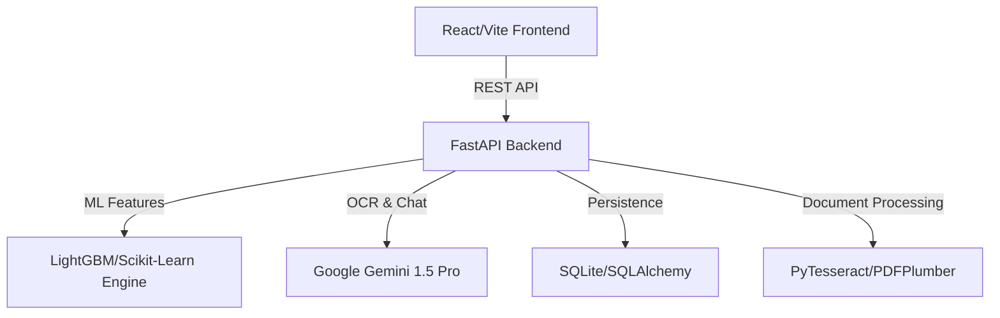

# ⚡ VoltIQ — Intelligence for the Modern Grid

**VoltIQ** is a production-grade residential electricity analytics platform designed for the Indian market. It transforms opaque utility bills into high-fidelity data narratives, empowering homeowners with AI-driven insights, appliance-level breakdown, and actionable fiscal diagnostics.

---

## 🌟 Vision
To bridge the gap between consumer consumption and grid-level intelligence, making energy efficiency intuitive, predictive, and rewarding.

## 🚀 Core Features

### 🔍 AI-Driven Bill Intelligence
*   **Omnichannel Ingestion:** Upload PDFs or scan paper bills via mobile.
*   **Neural OCR:** High-precision extraction of slab rates, tax components, and consumption metrics using **Google Gemini**.
*   **Smart Reconciliation:** Automatic verification of current billing against historical averages to detect leakages or incorrect meter readings.

### 🏠 Persistent Household DNA
*   **Cloud Synchronization:** Secure storage of residence metadata, family size, and appliance inventory.
*   **Household Profiling:** Your energy profile follows you across devices and sessions, ensuring a unified analytical experience.

### 🧬 Deep Hardware Analytics (Appliance Fingerprinting)
*   **ML Diagnostics:** Individual efficiency scoring for every appliance in your fleet.
*   **Health Recalibration:** Log repairs to permanently recalibrate hardware health scores.
*   **6-Bill Calibration:** High-precision diagnostic trust achieved after a short 6-month historical baseline.

### 💰 Fiscal & Environmental Diagnostics
*   **Slab Tax Analysis:** Advanced breakdown of Indian utility taxes and slab-based pricing.
*   **Carbon Tracker:** Real-time environmental impact monitoring grounded in actual consumption patterns.
*   **Budget Optimizer:** Personalized, RUPEE-based savings recommendations.

### 💬 Volt Chat — The Energy Assistant
*   A streamlined, conversational AI interface designed for deep-dive queries ("Why was my Bill 20% higher this month?") without UI friction.

---

## 🛠️ Architecture & Tech Stack

*   **Frontend:** React 18, Vite, Tailwind CSS (Custom Design System).
*   **Backend:** FastAPI (Python 3.10+).
*   **Database:** SQLAlchemy ORM with SQLite (Local-first/Scalable).
*   **AI Engine:** Google Gemini, LightGBM (Gradient Boosting), Scikit-learn.

---

## 🏁 Quick Start

### 📋 Prerequisites
*   **Node.js** (v18+)
*   **Python** (3.10+)
*   **Gemini API Key** ([Get it here](https://aistudio.google.com/))

### 🏗️ Backend Setup
1. `cd backend`
2. `pip install -r requirements.txt`
3. Create `.env` with `GEMINI_API_KEY=your_key`
4. `python main.py`

### 🎨 Frontend Setup
1. `cd frontend`
2. `npm install`
3. `npm run dev`

---

## 🛡️ License
Built for private development and research as part of the **VoltIQ Platform Roadmap**.
